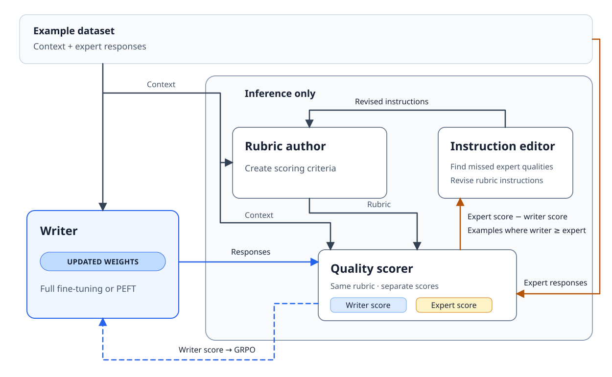

# rlxar

`rlxar` is an implementation of Meta’s [Reinforcement Learning from eXpert-Aligned Rubrics](https://facebookresearch.github.io/RAM/blogs/unslop/).
For each context, it generates a rubric without exposing the expert answer, revises the rubric meta-prompt from training failure cases and the train expert-minus-policy gap, selects among the candidate prompts by validation expert-minus-policy gap, and uses the resulting judge scores as scalar rewards for GRPO updates to a local writer with a LoRA adapter.



## Quick start

### Install and validate the example data

Python 3.11 or newer is required. Install the project with [`uv`](https://docs.astral.sh/uv/):

```sh
uv sync
uv run rlxar validate examples/demo.jsonl
```

The example dataset has 8 training, 2 validation, and 2 test examples. Every JSONL row must contain `id`, `group_id`, `context`, `expert`, and one of `train`, `validation`, or `test` as `split`. IDs must be unique, all three splits must be present, and one `group_id` cannot appear in multiple splits.

```sh
uv run rlxar demo --use-cpu --steps 1 --output /tmp/rlxar-demo
```

This downloads the default Hugging Face writer (`Qwen/Qwen2.5-0.5B-Instruct`) if needed, runs one local GRPO step, and writes a timestamped run directory beneath `/tmp/rlxar-demo/`; that directory contains `manifest.json` and a `checkpoint/` subdirectory containing the LoRA adapter. It uses a frozen rubric and deterministic lexical reward, so it is a wiring smoke test rather than evidence of writing quality. Omit `--use-cpu` to let the demo select CUDA when available.

### Run the configured pipeline

The full pipeline uses a local Hugging Face causal language model as the trainable writer and a chat model for rubric generation, rubric scoring, meta-prompt revision, and held-out evaluation. The writer must be loadable locally by Transformers because it is generated from and LoRA-trained by the process. Chat interfaces are discovered through [Trance](https://github.com/MaxTretikov/trance) and used through Pydantic AI.

Judge discovery is explicit and consent-gated:

1. Copy `examples/demo.toml` to `examples/local.toml`. The example intentionally contains no judge settings; discovered judge selection is a user decision at run time.
2. Run the discovery command:

   ```sh
   uv run rlxar judges
   ```

   Trance scans configured chat interfaces and prints every candidate's canonical provider ID, exact model, authentication kind, and configuration source. Discovery does not send model inference requests or consume a provider rate limit; depending on the configured interface, Trance may invoke an installed CLI to inspect authentication status. It does not select a judge.
3. If the selected interface requires a key, export it according to the authentication information shown by `rlxar judges` before approving the run. For example:

   ```sh
   export OPENAI_API_KEY='your-api-key'
   ```

4. Choose a displayed candidate and approve it before running the pipeline. Without `--model-provider`, an interactive terminal presents the discovered candidates and asks which one to use and for confirmation. For automation, provide the provider you have approved:

   ```sh
   uv run rlxar run --config examples/local.toml --model-provider openai
   ```

   `--model-provider` is explicit consent and makes the run noninteractive. The value is matched against Trance's canonical provider IDs, then the first matching discovery result is used. The run still displays all discovered judges and the exact selected model and configuration source before sending requests. Provider aliases include `codex` for `openai-codex` and `grok` for `grok-consumer`; the xAI API provider ID is `xai`. If no provider is supplied, interactive selection and confirmation remain required. A noninteractive run fails closed when the provider is missing or has no matching Trance result. Approved rubric and evaluation requests may consume provider rate limits.

Set `output_dir` in the TOML or `RL_XAR_OUTPUT_DIR` in the environment to choose the external run root. Otherwise runs go to `/mnt/archive/runs/rl-xar` when that location is writable, or `$XDG_DATA_HOME/rl-xar/runs`. A completed run contains `manifest.json`, `round-*/adapter/`, `round-*/rubrics.json`, `round-*/meta_prompt.json`, `test_continuations.json`, `test_evaluation.json`, and `run.json`.

The configured defaults are three rubric iterations, three outer rounds, 100 GRPO steps per round, four generations, and seed 42. GRPO requires at least two generations. Reduce `outer_rounds`, `rubric_iterations`, `grpo_steps`, and `generations` for a smaller experiment; the example config already uses one outer round, two rubric iterations, ten steps, and two generations.

## Python API

The main building blocks are available under `rlxar`: data loading and schema validation, local writer rollouts, rubric generation, rubric judging, GRPO reward construction, and pipeline orchestration. The CLI exposes:

```sh
uv run rlxar --help
uv run rlxar validate PATH_TO_DATASET.jsonl
uv run rlxar judges
uv run rlxar demo --help
uv run rlxar run --help
```
